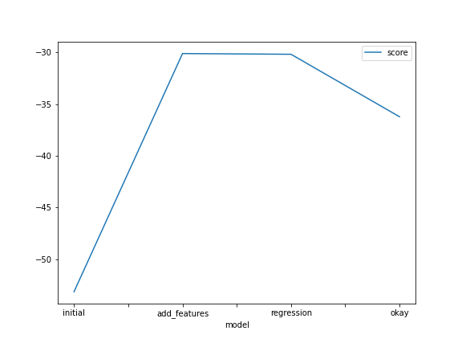
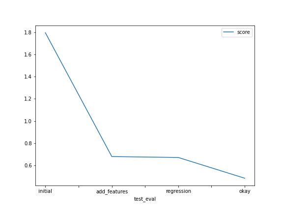

# Report: Predict Bike Sharing Demand with AutoGluon Solution
#### Elizabeth Kresock

## Initial Training
### What did you realize when you tried to submit your predictions? What changes were needed to the output of the predictor to submit your results?
I had to follow the instructions carefully in the Jupyter notebook, and apply what my Udacity instructor advised in order to run my project successfully in the SageMaker Studio. This included accepting the Rules in the Kaggle website for the Bike Sharing Competition. I also needed to download my API key. I made sure to correctly code the datetime sub-divisions and the categories. I also looked at the AutoGluon Tabular In Depth webpage for guidance. I had to make sure I was counting the correct predictions for each model I trained, which meant I updated the name of the submission files as I went along. I had to make sure that when I wrote my submission files as csv files, they had unique names. I trained many models, more than the ones mentioned in this report, so keeping my code clean and unique was critical.

### What was the top ranked model that performed?
My top ranked model was the predictor_okay model with kaggle score of 0.4835! This model used the most hyperparamter tuning of all the models.

## Exploratory data analysis and feature creation
### What did the exploratory analysis find and how did you add additional features?
The histograms revealed the distributions of various features. For example, temp, and atemp appeared to follow a normal distribution. Datetime could be split into sub-divisions, so I split it into year, month, day, and hour, which greatly improved the model. I could also see that most months had similar activity, aside from January and December, which had peaks in the histograms. Humidity looked somehwat normal, with a slight skew to the left. Windspeed had a skew to the right, and so did the fields casual, registered, and count. workingday and holiday were binary fields.

### How much better did your model preform after adding additional features and why do you think that is?
My model went from kaggle score of 1.7967 to 0.6789 when I added additional features, which is about a 62% improvement from the initial model. There were valuable differences in the behavior of the sub-divisions of datetime. Thus, when I split datetime into year, month, day, and hour, the model was able to adjust more accurately by adding these features.

## Hyper parameter tuning
### How much better did your model preform after trying different hyper parameters?
My top ranked model was the predictor_okay model with kaggle score of 0.4835! This is a 29% improvement from the add_features model, and a 73% improvement from the initial model. I named it predictor_okay because I thought it would do okay, but not the best because it implemented the most hyperparameters from the autogluon.core. For this model, I used the AutoGluon Tabular In Depth webpage to modify the nn_options - neural network model options and the gbm_options - options for lightGBM gradient boosted trees. The nn_options included num_epochs, learning rate, activation, layers, and dropout probability. The gbm_options included num_boost_round and num_leaves. I also set the search strategy to be auto, and the scheduler to be local.

### If you were given more time with this dataset, where do you think you would spend more time?
I would spend more time playing with the predictor_okay model! I would increase the training time and number of epochs for the nn_options. I would also experiment with the learning rate. In terms of features, I would create a feature that categorizes morning, lunch, and evening rush hour. These rush hours could be from 7-9am, 11am-1pm, and 5-6pm, respectively. I would also like to create more visualizations, for example, I could plot a correlation matrix of all features or create a heatmap of features. Lastly, I would like to read up and test out more of the AutoGluon Tabular documentation.

### Create a table with the models you ran, the hyperparameters modified, and the kaggle score.
|model|time_limit|presets|hp_method|score|
|--|--|--|--|--|
|initial|600|best_quality|none|1.7967|
|add_features|600|best_quality|none|0.6789|
|regression|600|best_quality|problem_type_regression|0.6708|
|okay|600|best_quality|nn_gbm_more|0.4835|

### Create a line plot showing the top model score for the three (or more) training runs during the project.

### Create a line plot showing the top kaggle score for the three (or more) prediction submissions during the project.

## Summary
This project taught me how to use exploratory data analysis to understand data, find features that are the most meaningful for that data, and tune hyperparameters to improve models of that data. Using more features and data points can help your predictions become more accurate. Also, there are a variety of hyperparameters, like for neural network models, that greatly improve the building accurate machine learning models. The initial model was bare and ineffective. When more features were added, the model improved by 62%. My third model, regression, was just the add_features model, but with the hyperparameter problem_type="regression". This only improved the kaggle score by 1%. However, when implementing the hyperparameters available in autogluon.core, the best kaggle score was achieved: 0.4835.